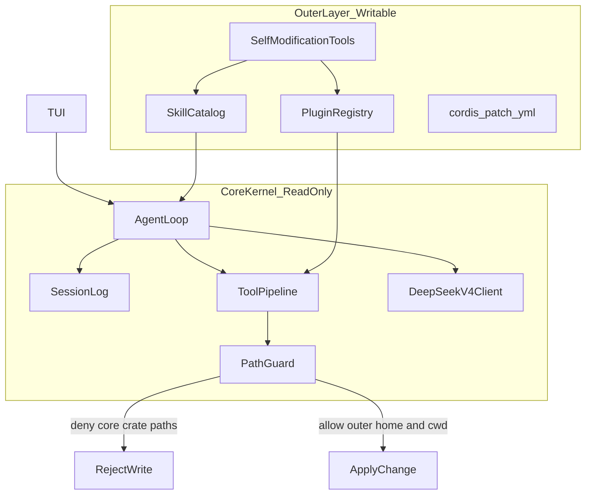

# dsh-rust

用 Rust 重写的 [DeepSeek Harness](https://github.com/deepseek-ai/deepseek-harness) 风格编程助手：**终端里就能对话、改代码、跑命令**，交互对齐 Codex CLI，模型默认走 DeepSeek。

> 仓库：[`deepseek-harness-rust-optimize`](https://github.com/Ar1haraNaN7mI/deepseek-harness-rust-optimize)

---

## 30 秒上手

推荐直接用 Cargo 启动（会自动编译）：

```bash
git clone https://github.com/Ar1haraNaN7mI/deepseek-harness-rust-optimize.git
cd deepseek-harness-rust-optimize

# 配置 API Key（任选）：在 TUI 里 /apikey sk-...，或先跑：
cargo run -p dsh-cli -- login

# 启动 TUI（最常用）
cargo run -p dsh-cli
```

Windows（PowerShell）同样：

```powershell
cargo run -p dsh-cli -- login
cargo run -p dsh-cli
```

没有 Key 也能先打开界面；真正发消息前再用 `/apikey` 配置即可。

需要独立可执行文件时再编译 release：

```bash
cargo build -p dsh-cli --release
./target/release/dsh          # Windows: .\target\release\dsh.exe
```

---

## 它能做什么

| 场景 | 怎么用 |
|------|--------|
| 交互改代码 | `cargo run -p dsh-cli` 进入 TUI，直接打字 |
| 一次性任务 / CI | `cargo run -p dsh-cli -- exec "修复 lint 错误"` |
| 继续上次对话 | `cargo run -p dsh-cli -- resume --last` |
| 代码审查 | `cargo run -p dsh-cli -- review --uncommitted` |
| 诊断环境 | `cargo run -p dsh-cli -- doctor` |

TUI 里常用：

- **Enter** 发送 · **Alt+Enter** 换行 · **Esc** 取消当前回合
- **鼠标点击** 对话区 / 输入框切换焦点 · **滚轮** 滚动对话
- **`/help`** 看全部斜杠命令 · **`/keymap`** 看快捷键
- **`!command`** 后台跑 shell · **`@path`** 提到某个文件

---

## 两层架构（为什么更稳）



| 层 | 内容 | 可变性 |
|---|---|---|
| **Core** | agent-loop、session 事件日志、tools waterfall、LLM 客户端、PathGuard、内置工具（read/edit/shell/skill） | 编译进二进制；运行时 **禁止** 模型改 `crates/`、`Cargo.toml`、可执行文件自身 |
| **Outer** | `~/.dsh-rust/` 与工作区 `.dsh-rust/`：plugins、skills、`patch.yml`、自动标签索引 | 模型可通过工具增删改；热加载；失败隔离 |

```text
dsh-rust/
  Cargo.toml
  crates/
    dsh-core/      # session, events, agent-loop, system-prompt
    dsh-llm/       # DeepSeek V4 streaming + tools
    dsh-tools/     # tool registry + pre/execute/post waterfall
    dsh-fs/        # fs + PathGuard
    dsh-plugin/    # outer plugin load/unload/hot-reload + tags
    dsh-skill/     # dual-format skill discovery + progressive load
    dsh-tui/       # ratatui chat / tools / plugins pane
    dsh-cli/       # `dsh` binary: tui | headless | plugin | skill
  outer/           # seeded outer templates (safe defaults)
  config/default.toml
  README.md
```

- **内核**不会被模型改坏：`crates/`、`Cargo.toml` 等写入会被 PathGuard 拒绝。
- **外层**可热扩展：插件（Rhai）、Skills（OpenAI `SKILL.md` + DeepSeek 风格）、会话、学习权重都在用户目录。
- 外层变更先写入临时目录 → 校验 → 原子替换；失败则保留上一版。插件在 **Rhai 沙箱**中执行，危险能力只能经 core 已注册宿主工具代理。

---

## 安装要求

- Rust **1.75+**（推荐较新的 stable）
- DeepSeek API Key（[开放平台](https://platform.deepseek.com/)）
- 可选：Git（`/diff`、`dsh review` 会用到）

Key 存放位置（**不要提交到 Git**）：

- `~/.dsh-rust/credentials.env`（推荐：`cargo run -p dsh-cli -- login`）
- 或环境变量 `DEEPSEEK_API_KEY`
- 或本地 `.env`（已在 `.gitignore`）

---

## 常用命令

开发时用 `cargo run -p dsh-cli -- …`；若已 `cargo build --release`，把前缀换成 `./target/release/dsh`（Windows：`.\target\release\dsh.exe`）即可。

```bash
cargo run -p dsh-cli                                    # 交互 TUI（默认）
cargo run -p dsh-cli -- "帮我看看这个仓库"               # 启动并自动发送第一句
cargo run -p dsh-cli -- exec "列出所有 TODO"            # 非交互（别名：e）
cargo run -p dsh-cli -- exec --json "..."               # NDJSON 事件流
cargo run -p dsh-cli -- resume --last                   # 恢复最近会话
cargo run -p dsh-cli -- session list
cargo run -p dsh-cli -- skill list
cargo run -p dsh-cli -- plugin list
cargo run -p dsh-cli -- doctor                          # 环境自检
cargo run -p dsh-cli -- -h                              # 完整 CLI 帮助
```

全局旗标（对齐 Codex）：

```bash
cargo run -p dsh-cli -- -m deepseek-v4-flash -s workspace-write -a on-request "小改动"
cargo run -p dsh-cli -- --yolo exec "在沙箱外放开手脚跑（慎用）"
```

| 旗标 | 含义 |
|------|------|
| `-m / --model` | 模型，如 `deepseek-v4-pro` / `deepseek-v4-flash` |
| `-s / --sandbox` | `read-only` · `workspace-write` · `danger-full-access` |
| `-a / --ask-for-approval` | `never` · `on-request` · `untrusted` |
| `--add-dir` | 额外允许的目录 |
| `-C / --cd` | 先切换工作目录再启动 |

---

## TUI 斜杠命令（精选）

输入 `/` 后按 **Tab** 可补全。

| 命令 | 作用 |
|------|------|
| `/help` `/help all` | 帮助（分主题：`session` `agent` `ui` `keys`…） |
| `/apikey` `/logout` | 配置 / 清除 API Key |
| `/model` `/permissions` `/approval` `/sandbox` | 模型与权限 |
| `/new` `/clear` `/resume` `/fork` `/compact` | 会话管理 |
| `/plan` `/review` `/diff` `/status` | 计划、审查、差异、状态 |
| `/ps` `/stop` | 后台终端 |
| `/vim` `/raw` `/sidebar` `/keymap` | 界面 |

完整列表见 TUI 内 `/help all`。

---

## Skills 与插件

**Skills** 自动扫描（OpenAI 标准 + DeepSeek/dsh）：

- 项目：`.agents/skills/`、`.dsh/skills/`
- 用户：`~/.dsh-rust/skills`、`~/.agents/skills`
- 仓库示例：`outer/bundled-skills/`

**Plugins** 外层 `plugin.yml` + Rhai，安装到 `~/.dsh-rust/plugins`。

```bash
dsh plugin list
dsh plugin add ./outer/plugins/echo-plugin
dsh plugin marketplace add owner/repo
```

---

## 配置与数据目录

| 路径 | 内容 |
|------|------|
| `config/default.toml` | 默认模型、PathGuard、TUI、CTM |
| `~/.dsh-rust/settings.toml` | 权限、主题、审批策略等 |
| `~/.dsh-rust/sessions/` | 会话记录 |
| `~/.dsh-rust/features.toml` | Feature flags |
| `~/.dsh-rust/mcp.toml` | MCP 服务器 |
| `~/.dsh-rust/hooks.toml` | 生命周期 hooks |
| `~/.dsh-rust/rules/` | execpolicy 规则 |

示例规则：`outer/rules/default.toml`  
检查：`dsh execpolicy check --rules outer/rules/default.toml --pretty -- rm -rf /tmp/x`

---

## 开发

```bash
cargo run -p dsh-cli              # 日常启动（推荐）
cargo run -p dsh-cli -- doctor
cargo build -p dsh-cli            # 仅编译
cargo build -p dsh-cli --release  # 发布产物
```

Workspace crates：`dsh-core` · `dsh-llm` · `dsh-tools` · `dsh-fs` · `dsh-skill` · `dsh-plugin` · `dsh-tui` · `dsh-cli`

---

## 安全提示

- 不要把 API Key 写进仓库或截图进 README。
- `read-only` / `on-request` 适合日常；`--yolo` 仅在隔离环境使用。
- 内核路径受 PathGuard 保护；外层变更失败可回滚，不拖垮主循环。

---

## License

MIT（见仓库 `license` 字段 / 后续 LICENSE 文件）。

灵感与语义对齐：[deepseek-ai/deepseek-harness](https://github.com/deepseek-ai/deepseek-harness)。交互体验参考 [OpenAI Codex CLI](https://developers.openai.com/codex/cli/slash-commands)。
