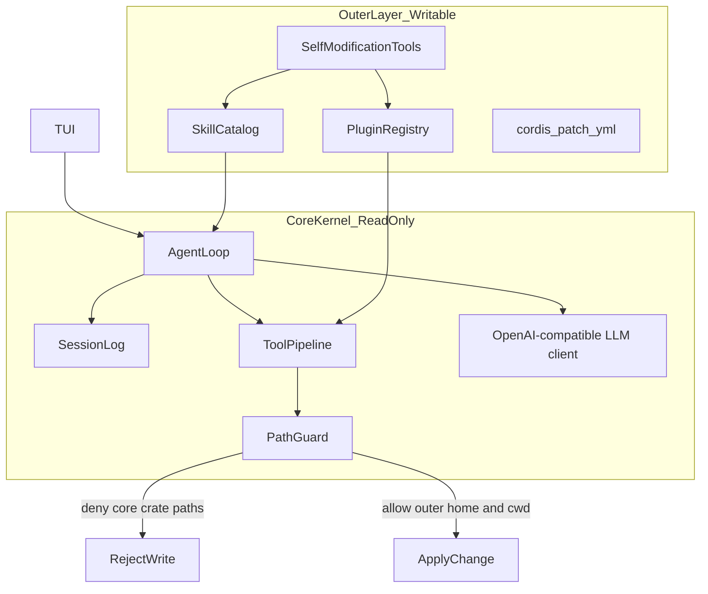

# dsh-rust

用 Rust 重写的 [DeepSeek Harness](https://github.com/deepseek-ai/deepseek-harness) 风格编程助手：**终端里就能对话、改代码、跑命令**，交互对齐 Codex CLI，模型默认走 DeepSeek。

> 仓库：[`deepseek-harness-rust-optimize`](https://github.com/Ar1haraNaN7mI/deepseek-harness-rust-optimize)

---

## 安装后在任意目录使用

先克隆仓库并安装一次。需要 Rust/Cargo、Python 3 和 Node.js 22.12+：

```bash
git clone https://github.com/Ar1haraNaN7mI/deepseek-harness-rust-optimize.git
cd deepseek-harness-rust-optimize

python scripts/install_dsh.py
```

安装器编译 release 版 `dsh` 和网页资源，安装到 `CARGO_HOME`（未设置时为 `~/.cargo`）。Windows 会在需要时补充用户 PATH；如果安装器提示 PATH 已更新，请重新打开终端。macOS/Linux 按安装器提示将安装目录的 `bin` 加入 PATH。

之后在任何项目目录运行，当前目录就是 DSH 的工作区：

```powershell
dsh login                  # 保存模型凭据；只需配置一次
dsh                        # 当前目录打开 TUI
dsh --startup              # 播放启动动画后进入 TUI
dsh startup next on        # 只在下一次交互启动播放
dsh web --startup          # 当前目录启动网页 Harness
dsh -C "D:\projects\demo"  # 显式选择另一个工作区
```

`dsh web` 默认使用已安装的网页资源，打开 `http://127.0.0.1:8770/`，不需要回到源码目录或手动传 `--assets`。用户名、凭据和一次性启动设置仍保存在用户目录；当前项目的技能、插件和文件范围随工作目录切换。没有 Key 也能先打开界面，真正发消息前再用 `/apikey` 配置即可。

项目专属配置可以放在 `.dsh-rust/config.toml`，或通过 `--config <路径>` 指定。旧的 `config/default.toml` 只有包含 DSH 的 `[llm]` 和 `[paths]` 配置表时才自动加载，避免误读其他项目的同名文件。显式指定的配置和专属配置有误时仍会报错。

`dsh web` 在交互终端启动后会自动打开默认浏览器。如果端口已有 DSH Harness，先询问是否直接打开现有页面；选否后再询问是否关闭旧服务并在当前工作区重新启动；再次选否则返回第一问。输入 `y`/`n`（或“是”/“否”），Ctrl+C 退出。复用时沿用旧服务的工作区，重启时使用当前工作区；`--startup`/`--no-startup` 会传给本次打开的页面。`--no-open` 禁止自动打开浏览器。非交互调用遇到占用会直接返回错误，可通过 `--port` 选择其他端口。

更新时在源码仓库 `git pull` 后再次运行 `python scripts/install_dsh.py`。也可从任意目录使用安装脚本的绝对路径。`--root <目录>` 指定安装位置，`--debug` 安装调试版。

开发者仍可在仓库根目录直接运行 Cargo：

```bash
cargo run -p dsh-cli -- --startup
```

`cargo run` 是源码开发命令，需要找到仓库的 `Cargo.toml`；日常跨目录使用 `dsh`。

---

## 它能做什么

| 场景 | 怎么用 |
|------|--------|
| 交互改代码 | `dsh` 进入 TUI，直接打字 |
| 一次性任务 / CI | `dsh exec "修复 lint 错误"` |
| 继续上次对话 | `dsh resume --last` |
| 代码审查 | `dsh review --uncommitted` |
| 诊断环境 | `dsh doctor` |
| 启动动画预览 | `dsh startup` |

TUI 里常用：

- **Enter** 发送 · **Alt+Enter** 换行 · **Esc** 取消当前回合
- **鼠标点击** 对话区 / 输入框切换焦点 · **滚轮** 滚动对话
- **`/help`** 看全部斜杠命令 · **`/keymap`** 看快捷键
- **`!command`** 后台跑 shell · **`@path`** 提到某个文件

---

## DSH 启动动画（可选）

内置原创电影式启动序列：**厂牌唤醒 → 本地连接 → 个人档案 → 技能与插件清单 → 加载结果 → 欢迎进入 DSH**。原创 DELTA CIRCUIT 平面徽章以三角形为主体：左侧 D 字轨、底部 S 折线与右侧 H 连接共同形成轮廓，内部保留小型 DSH 刻字和三层扫描线。分件飞入、高速环扫、平面扫描与档案展开保持扁平风格。高清版没有底部控制栏，按 C 或点右上角省略号打开设置。

动画**默认关闭**。启用后在开场、个人档案、加载结果三个节点等待确认；等待时旋转环和扫描仍持续运动。确认后连续播放两幕，再到下一节点；终端最后自动进入对话，`dsh web` 的嵌入动画完成或跳过后进入真实 Harness，`dsh startup web` 独立预览停留在欢迎画面。基础演出为 **13.8 秒**；交互等待、真实读取和较长旁白会延长停留时间，不截断声音。终端独立预览可用 `--auto` 完整自动播放。

编排参考 [dsh-startup-screen 的序列与确认机制](https://github.com/6shenhonghong9/dsh-startup-screen/blob/main/lib/splash.js)。本项目的字徽、图形部件及电子音效自行绘制和合成。旁白使用预先生成的固定英文录音，统一称呼 **OPERATOR**，只说明实际阶段，不念自定义用户名、变化的数量或逐项技能／插件名。动画等待每句播完；失败与部分失败使用独立的提示录音。运行时不调用系统 TTS，也无需加载语音模型。音频无法播放时仍保留画面和电子音效。

固定旁白由 Qwen3-TTS 的参考音色生成流程制作（不是单独微调模型），模型版本、参考片段与英文台词记录在 [`docs/assets/voice/manifest.json`](docs/assets/voice/manifest.json)。[`scripts/generate_startup_voice.py`](scripts/generate_startup_voice.py) 可重新生成；[`scripts/sync_startup_voice.py`](scripts/sync_startup_voice.py) 校验并同步终端内嵌音频。生成环境仅用于制作资产，不是 CLI 运行依赖。

高清版通过 `dsh startup web` 启动，浏览器打开命令输出的本机地址（默认 `http://127.0.0.1:8769/startup-preview.html`）。HTML、JS 和徽章已嵌入 CLI，无需额外前端运行时。直接用静态服务器打开 [`docs/startup-preview.html`](docs/startup-preview.html) 只能观看离线演出，会明确显示未连接本机数据。

网页的中间段会调用与 DSH 相同的 `SkillCatalog` 与 `PluginRegistry`，实际读取目录、解析技能、编译校验插件并挂载技能／工具定义，实时传回名称、来源、成功与失败项。最终数量取自加载完成后的目录，包含插件附带技能，空目录显示零；不会用动画时间伪造百分比。独立预览保留自己的注册表，不创建会话、不启动调度器或热更新、不执行插件工具。正常 TUI 启动已在动画前加载目录，因此终端展示的是本次启动**已加载**的快照。两者都不假称完成模型推理或远程鉴权。

用户名与编号由网页设置保存，或使用 `startup profile` 命令；存储在当前 `outer_home/startup-profile.json`，网页与终端共用。未保存时使用系统用户名。切换 `--config` 或 `outer_home` 可以使用不同身份。

```bash
dsh --startup                           # 本次播放后进入真实 TUI 会话
dsh resume --last --startup              # 播放后继续上次会话
dsh web --startup                        # 启动动画后进入本机 Harness 网页
dsh web --port 8870 --assets web/dist     # 显式指定开发构建目录
dsh startup                              # 单独预览，不创建会话
dsh startup web                          # 高清版 + 真实本机加载接口
dsh startup web --port 8877               # 指定本机端口
dsh startup profile --name CatShark       # 保存自定义用户名
dsh startup profile                      # 查看已保存身份
dsh startup next on                      # 仅下次交互启动播放
dsh startup next off                     # 仅下次交互启动跳过
dsh startup --theme light                 # 浅色实验室主题
dsh startup --interactive                 # 三个节点点击 / Enter 确认（默认）
dsh startup --auto                        # 自动播放；等待旁白读完
dsh startup --auto --speed 1.5 --silent    # 加速、静音自动预览
dsh --no-startup                          # 本次直接进入 TUI
dsh --silent                             # 保留动画，关闭启动音
```

在三个确认节点，**任意位置鼠标左击 / Enter / Space** 都能继续。播放中点击或按 Enter 只注入可见的能量脉冲，不跳段、不打断音画；**1 / 2 / 3** 或 **← / →** 可随时改变视觉焦点，无需操作固定选项表单。终端支持左击；拖动效果属于高清浏览器版。随时可用 **Esc** 跳过、**Ctrl+C** 退出、**M** 切换静音。`--auto` 与 `--interactive` 互斥。独立预览无需 API Key；`exec`、`--json`、MCP 与 app-server 等非交互入口不会播放启动动画。

`--startup` 只为本次交互启动启用动画，完成或按 Esc 跳过后进入会话；它也适用于 `tui`、`resume`、`fork`、`app` 和 `web`。`web` 在本机端口 8770 提供 Harness 页面，优先读取可执行文件所在安装目录的 `share/dsh/web`，没有安装资源时尝试当前目录的 `web/dist`；显式 `--assets` 始终优先，路径错误会直接报错。网页复用真实 Runtime、会话、技能与插件；`startup web` 仍是独立动画预览。非交互命令即使带 `--startup` 也不会播放动画。

`startup next on|off` 保存一次性选择；只有下一次成功进入受支持终端的交互启动才会消费它。预览、网页、非交互命令、重定向输出或启动失败都不会消费。消费后恢复配置文件的长期设置；显式 `--startup` / `--no-startup` 优先于该选择，但本次合格的终端启动仍会消费它。两个旗标不能同时使用。多个 CLI 同时启动时，同一选择只会由一个进程取得。

长期设置放在 `config/default.toml`，也可以用 `--config <路径>` 读取自己的配置：

```toml
[tui.startup]
enabled = false         # 改为 true 后每次交互启动播放
sound = true
volume = 0.35           # 0.0 到 1.0
speed = 1.0             # 0.25 到 3.0；越大越快
theme = "dark"          # dark / light
interactive = true     # 在三个节点点击 / Enter 确认；false 则自动播放
reduced_motion = false # true 时显示静态启动画面
```

`--startup`、`--no-startup` 与 `--silent` 只影响本次运行，默认仍关闭动画。音频设备或播放后端不可用时，动画仍可继续。

其他 Rust 代码也可设置下次启动行为，无需启动代理或调度器：

```rust
pub fn enable_next_boot(config: &dsh_core::AppConfig) -> anyhow::Result<()> {
    dsh_core::set_next_startup(&config.resolve_outer_home()?, true)
    // 传 false 即可让下次启动跳过。
}
```

一次性选择保存在当前 `outer_home` 的 `startup-next.txt`，由交互 TUI 原子消费。`set_next_startup` 只设置偏好；`take_next_startup` 供启动流程取得并消费偏好。

---

## 两层架构（为什么更稳）



| 层 | 内容 | 可变性 |
|---|---|---|
| **Core** | agent-loop、session 事件日志、tools waterfall、LLM 客户端、PathGuard、内置工具（read/edit/shell/skill） | 编译进二进制；运行时 **禁止** 模型改 `crates/`、`Cargo.toml`、可执行文件自身 |
| **Outer** | `~/.dsh-rust/` 与工作区 `.dsh-rust/`：plugins、skills、`patch.yml`、自动标签索引 | 模型可通过工具增删改；热加载；失败隔离 |

```text
dsh-rust/
  Cargo.toml
  crates/
    dsh-core/      # session, events, agent-loop, system-prompt
    dsh-llm/       # OpenAI-compatible streaming + tools
    dsh-tools/     # tool registry + pre/execute/post waterfall
    dsh-fs/        # fs + PathGuard
    dsh-plugin/    # outer plugin load/unload/hot-reload + tags
    dsh-skill/     # dual-format skill discovery + progressive load
    dsh-tui/       # ratatui chat / tools / plugins pane
    dsh-protocol/  # versioned task/event/cloud wire contracts
    dsh-app-client/ # reconnecting JSON-RPC client + event cursor
    dsh-cli/       # `dsh` binary: tui | headless | plugin | skill
  outer/           # seeded outer templates (safe defaults)
  config/default.toml
  README.md
```

- **内核**不会被模型改坏：`crates/`、`Cargo.toml` 等写入会被 PathGuard 拒绝。
- **外层**可热扩展：插件（Rhai）、Skills（OpenAI `SKILL.md` + DeepSeek 风格）、会话、学习权重都在用户目录。
- 外层变更先写入临时目录 → 校验 → 原子替换；失败则保留上一版。插件在 **Rhai 沙箱**中执行，危险能力只能经 core 已注册宿主工具代理。

---

## 安装要求

- Rust **1.75+**（推荐较新的 stable）
- DeepSeek API Key（[开放平台](https://platform.deepseek.com/)）
- 可选：Git（`/diff`、`dsh review` 会用到）

Key 存放位置（**不要提交到 Git**）：

- `~/.dsh-rust/credentials.env`（推荐：`cargo run -p dsh-cli -- login`）
- 或环境变量 `DEEPSEEK_API_KEY`
- 本地/兼容后端也可使用 `DSH_LLM_API_KEY` / `OPENAI_API_KEY`
- 或本地 `.env`（已在 `.gitignore`）

---

## 常用命令

开发时用 `cargo run -p dsh-cli -- …`；若已 `cargo build --release`，把前缀换成 `./target/release/dsh`（Windows：`.\target\release\dsh.exe`）即可。

```bash
cargo run -p dsh-cli                                    # 交互 TUI（默认）
cargo run -p dsh-cli -- "帮我看看这个仓库"               # 启动并自动发送第一句
cargo run -p dsh-cli -- exec "列出所有 TODO"            # 非交互（别名：e）
cargo run -p dsh-cli -- exec --json "..."               # NDJSON 事件流
cargo run -p dsh-cli -- resume --last                   # 恢复最近会话
cargo run -p dsh-cli -- session list
cargo run -p dsh-cli -- skill list
cargo run -p dsh-cli -- plugin list
cargo run -p dsh-cli -- doctor                          # 环境自检
cargo run -p dsh-cli -- config security-research on     # 授权网安研究模式
cargo run -p dsh-cli -- events --follow --json     # 持续消费 durable event 流
cargo run -p dsh-cli -- cloud import ./change.patch   # 导入可审计补丁
cargo run -p dsh-cli -- cloud list                    # 列出补丁 artifact
cargo run -p dsh-cli -- apply art-... --dry-run       # 经 PathGuard 预览应用
cargo run -p dsh-cli -- app-server --listen 127.0.0.1:4567  # TCP 控制面
cargo run -p dsh-cli -- -h                              # 完整 CLI 帮助
```

TCP app-server 可通过 `DSH_APP_SERVER_TOKEN` 启用认证；客户端在首次
`initialize` 请求的 `auth_token` 参数中提交同一 token。监听非 loopback
地址时建议始终设置该变量。

Cloud artifact 也可以通过远程 app-server 管理；`--server` 只改变
artifact 的读取/导入位置，最终写入仍发生在运行 `dsh apply` 的本地工作区：

```bash
dsh cloud list --server 127.0.0.1:4567
dsh cloud import ./change.patch --server 127.0.0.1:4567
dsh apply art-... --server 127.0.0.1:4567 --dry-run
```

应用前会校验 artifact 记录的 canonical workspace identity 与当前工作区一致；
如果远端是另一份 checkout，请先在目标工作区重新导入补丁，避免把合法补丁
误写到错误的目录。

TCP 客户端在断线后会重新执行 `initialize`，并自动重试幂等读取与事件
long-poll；创建任务、审批、artifact 导入等有副作用请求不会盲目重放。
事件消费者使用 sequence cursor，因此进程重启后可从最后交付的事件继续。

全局旗标（对齐 Codex）：

```bash
cargo run -p dsh-cli -- -m deepseek-v4-flash -s workspace-write -a on-request "小改动"
cargo run -p dsh-cli -- --yolo exec "在沙箱外放开手脚跑（慎用）"
```

| 旗标 | 含义 |
|------|------|
| `-m / --model` | 模型，如 `deepseek-v4-pro` / `deepseek-v4-flash` |
| `-s / --sandbox` | `read-only` · `workspace-write` · `danger-full-access` |
| `-a / --ask-for-approval` | `never` · `on-request` · `untrusted` |
| `--add-dir` | 额外允许的目录 |
| `-C / --cd` | 先切换工作目录再启动 |
| `--startup` | 本次交互启动播放动画，然后进入 TUI 或 Harness 网页 |
| `--no-startup` | 本次跳过启动动画 |
| `--silent` | 本次关闭启动音效 |

---

## TUI 斜杠命令（精选）

输入 `/` 后按 **Tab** 可补全。

| 命令 | 作用 |
|------|------|
| `/help` `/help all` | 帮助（分主题：`session` `agent` `ui` `keys`…） |
| `/apikey` `/logout` | 配置 / 清除 API Key |
| `/model` `/permissions` `/approval` `/sandbox` | 模型与权限 |
| `/new` `/clear` `/resume` `/fork` `/compact` | 会话管理 |
| `/plan` `/review` `/diff` `/status` | 计划、审查、差异、状态 |
| `/ps` `/stop` | 后台终端 |
| `/vim` `/raw` `/sidebar` `/keymap` | 界面 |

完整列表见 TUI 内 `/help all`。

---

## Skills 与插件

**Skills** 自动扫描（OpenAI 标准 + DeepSeek/dsh）：

- 项目：`.agents/skills/`、`.dsh/skills/`
- 用户：`~/.dsh-rust/skills`、`~/.agents/skills`
- 仓库示例：`outer/bundled-skills/`

**Plugins** 外层 `plugin.yml` + Rhai，安装到 `~/.dsh-rust/plugins`。

```bash
dsh plugin list
dsh plugin add ./outer/plugins/echo-plugin
dsh plugin marketplace add owner/repo
```

---

## 配置与数据目录

| 路径 | 内容 |
|------|------|
| `config/default.toml` | 默认模型、PathGuard、TUI、CTM |
| `~/.dsh-rust/settings.toml` | 权限、主题、审批策略等 |
| `~/.dsh-rust/sessions/` | 会话记录 |
| `~/.dsh-rust/features.toml` | Feature flags |
| `~/.dsh-rust/mcp.toml` | MCP 服务器 |
| `~/.dsh-rust/hooks.toml` | 生命周期 hooks |
| `~/.dsh-rust/rules/` | execpolicy 规则 |

小于 70B 的模型会在 `llm.optimization.mode = "auto"` 下自动走紧凑策略：减少工具 schema、限制上下文和工具结果、降低单回合步数/输出 token、默认串行工具调用并关闭 thinking；通过 `parameter_count_b` 或 `DSH_MODEL_SIZE_B` 可覆盖模型别名的自动判断。MCP 之外还支持 Ollama、llama.cpp server、LM Studio、vLLM、SGLang、LiteLLM、LocalAI、TGI 和 MLX-LM 等开源 OpenAI-compatible 后端，并支持有序 fallback 与 provider-specific `extra_body`；详见 [`docs/small-models.md`](docs/small-models.md)。

```bash
cargo run -p dsh-cli -- debug backends
cargo run -p dsh-cli -- debug model-profile
cargo run -p dsh-cli -- --backend ollama -m qwen2.5:14b "检查测试"
cargo run -p dsh-cli -- --backend lm_studio -m qwen2.5-14b-instruct "检查测试"
cargo run -p dsh-cli -- --model-size-b 14 --model-optimization small "检查测试"
```

示例规则：`outer/rules/default.toml`  
检查：`dsh execpolicy check --rules outer/rules/default.toml --pretty -- rm -rf /tmp/x`

`security-research` 默认开启，用于已授权范围内的网安分析、漏洞复现、逆向和流量自动化：模型不会因为“网安”标签追加泛化拒答或法律免责声明。它只影响模型提示文本，不会绕过权限模式、审批、PathGuard、沙箱或审计；可用 `dsh config security-research off` 或 TUI `/security-research off` 关闭。

---

## 开发

```bash
cargo run -p dsh-cli              # 日常启动（推荐）
cargo run -p dsh-cli -- doctor
cargo build -p dsh-cli            # 仅编译
cargo build -p dsh-cli --release  # 发布产物
```

Workspace crates：`dsh-core` · `dsh-llm` · `dsh-tools` · `dsh-fs` · `dsh-skill` · `dsh-plugin` · `dsh-tui` · `dsh-protocol` · `dsh-app-client` · `dsh-cli`

---

## 安全提示

- 不要把 API Key 写进仓库或截图进 README。
- `read-only` / `on-request` 适合日常；`--yolo` 仅在隔离环境使用。网安研究模式不会改变这些运行时边界。
- 内核路径受 PathGuard 保护；外层变更失败可回滚，不拖垮主循环。

---

## License

MIT（见仓库 `license` 字段 / 后续 LICENSE 文件）。

灵感与语义对齐：[deepseek-ai/deepseek-harness](https://github.com/deepseek-ai/deepseek-harness)。交互体验参考 [OpenAI Codex CLI](https://developers.openai.com/codex/cli/slash-commands)。
